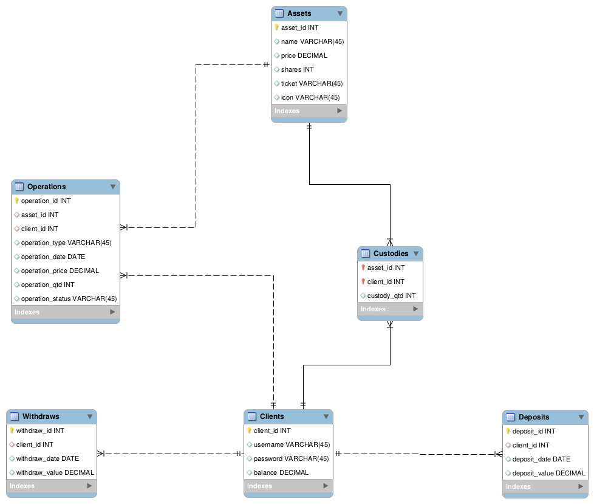

# Boas vindas ao projeto L3!

Para executar o projeto, observe as orientações descritas a seguir, e se tiver qualquer dúvida, sugestão, contribuição, considere abrir uma issue ou entrar em contato pelo email: calilisantos@gmail.com. 🚀

Aqui você vai encontrar os detalhes de como está estruturado e foi desenvolvido o projeto a partir deste repositório.


# Entregas


<details>
  <summary><strong> Desenvolvimento</strong></summary><br />

  Este projeto, foi desenvolvido para o Desafio Técnico da XP com a Turma XP da Trybe. 
  
  Foi escolhido o desafio de backend, utilizando o Node.js e o Sequelize ORM para construção da API apresentada a seguir. Também foi adotada a arquitetura MSC, buscando implementar os princípios Restful. Todas essas ferramentas introduzidas durante o curso da Trybe.
  
  O objetivo da aplicação desenvolvida é simular um aplicativo de investimento em ações com algumas funções de conta digital, utilizando dados fictícios para demonstrar o funcionamento da aplicação.
  

  ---

  

</details>

<details>
  <summary><strong> Período de entrega</strong></summary><br />
  
  * Este projeto foi individual
  * Foram `9` dias de projeto
  * Do dia `15/07/2022 09:00` ao dia: `24/07/2022 23:59`

</details>

# Orientações

<details>
  <summary><strong> Rodando no Docker vs Localmente</strong></summary><br />

  A aplicação foi pensada para ser testada com o Docker.
  
  Se sua opção for por usar esta ferramenta ou diretamente em sua máquina, considere as orientações abaixo.

  ## Com Docker

  > Rode o serviço `node` com o comando `docker-compose up -d`.
  - Esse serviço irá inicializar um container chamado `l3_project`.
  - A partir daqui você pode rodar o container `l3_project` via CLI ou abri-lo no VS Code.

  > Use o comando `docker exec -it l3_project bash`.
  - Ele te dará acesso ao terminal interativo do container criado pelo compose, que está rodando em segundo plano.

  > Instale as dependências com `npm install`.
  
  ⚠ Atenção ⚠ Caso opte por utilizar o Docker, **TODOS** os comandos disponíveis no `package.json` (npm start, npm test, npm run dev, ...) devem ser executados **DENTRO** do container, ou seja, no terminal que aparece após a execução do comando `docker exec` citado acima. 

---
  
  ## Sem Docker
  
  > Instale as dependências com `npm install`
  
  ✨ **Dica:** Para rodar o projeto desta forma, obrigatoriamente você deve ter o `node` instalado em seu computador.

  ✨ **Dica:** Recomenda-se a versão 16 ou superior do `node`, versão em que a aplicação foi desenvolvida.

---

  ## Após a instalação das dependências

  > Use os comandos `npm run prestart` e `npm run seed` para utilizar o banco de dados.
  - Eles inicializam e populam o banco de dados desenvolvido com o ORM Sequelize.

  > Inicie a aplicação com os comandos `npm start` ou `npm run debug`.
  - Para executar a aplicação em sua plataforma de API ou executá-la de forma contínua com o nodemon.

---

  <br/>
</details>


<details>
  <summary><strong> Linter</strong></summary><br />

  Foi utilizado o [ESLint](https://eslint.org/) para fazer a análise estática do código.

  Este projeto já vem com as dependências relacionadas ao _linter_ configuradas no arquivos `package.json`.

  Caso queira utilizar o `ESLint` durante a execução do projeto, use o comando `npm install` dentro do projeto e depois `npm run lint`. Se a análise do `ESLint` encontrar problemas no seu código, tais problemas serão mostrados no seu terminal. Se não houver problema no seu código, nada será impresso no seu terminal.

  Você também pode instalar o plugin do `ESLint` no `VSCode`: bastar ir em _extensions_ e baixar o [plugin `ESLint`](https://marketplace.visualstudio.com/items?itemName=dbaeumer.vscode-eslint).
</details>


<details>
  <summary><strong> Testes [Em desenvolvimento]</strong></summary><br />

  Serão utilizadas as bibliotecas Mocha, chai e sinon para desenvolvimento dos testes unitários. 

  A cobertura mínima do código definida foi de 70%, melhor descrita na seção de implementações.

  **_Para executar os testes localmente, digite no terminal o comando `npm test`._**

</details>

<details>
  <summary  id="diagrama"><strong> Diagrama ER e Entidades</strong></summary>

  ## Diagrama de Entidade-Relacionamento


  A construção das tabelas através do ORM, seguiu o seguinte *DER*:

  

  ---

  ## Formato das entidades


  Para a criação e atualização do banco de dados foi utilizado o `ORM Sequelize`. 

  A partir do DER, segue os exemplos com a descrição das tabelas do banco de dados:


  - Uma tabela chamada **Assets**, contendo dados com a seguinte estrutura:

    ```json
    {
      "asset_id": 5,
      "name": "Javascript",
      "price": 19.95,
      "shares": 100,
      "ticket": "JS7",
      "icon": "https://cdn.jsdelivr.net/gh/devicons/devicon/icons/javascript/javascript-original.svg",
    }
    ```
  - Uma tabela chamada **Clients**, contendo dados com a seguinte estrutura:

    ```json
    {
      "client_id": 2,
      "username": "Linus_T",
      "password": "1msatoshi",
      "balance": 10000,
    }
    ```

  - Uma tabela chamada **Custodies**, contendo uma **chave primária composta** utilizando os dois atributos da estrutura:

    ```json
    {
      "asset_id": 1, // Chave primária e estrangeira, referenciando o id de `Assets`
      "client_id": 1, // Chave primária e estrangeira, referenciando o id de `Clients`
      "custody_qtd": 80,
    }
    ```

  - Uma tabela chamada **Operations**, contendo dados com a seguinte estrutura:

    ```json
    {
      "asset_id": 1, // Chave estrangeira, referenciando o id de `Assets`
      "client_id": 1, // Chave estrangeira, referenciando o id de `Clients`
      "operation_type": "bid",
      "operation_date": "2022-07-01T13:58:51.947Z",
      "operation_price": 19.98,
      "operation_qtd": 20,
      "operation_status": "open",
    }
    ```

  - Uma tabela chamada **Deposits**, contendo dados com a seguinte estrutura:

    ```json
    {
      "deposit_id": 1,
      "client_id": 3, // Chave estrangeira, referenciando o id de `Clients`
      "deposit_date": "2022-07-01T13:50:05.721Z",
      "deposit_value": 500,
    }  
    ``` 

  - Uma tabela chamada **Withdraws**, contendo dados com a seguinte estrutura:

    ```json
    {
      "withdraw_id": 2,
      "client_id": 4, // Chave estrangeira, referenciando o id de `Clients`
      "withdraw_date": "2022-07-01T14:06:41.548Z",
      "withdraw_value": 1000
    }  
    ``` 

    *Os dados acima e do banco de dados são fictícios, e estão aqui apenas para simular o funcionamento da API de acordo ao Desafio XP.*

    *Os preços e os tickets das ações não são aleatórios. Dica: Estão associados com a história da linguagem?*

    ---

<br />

</details>

<details><summary><strong> Deploy da API</strong></summary><br />

Em construção


</details>

<details>
  <summary><strong> Mande seu feedback sobre o projeto!</strong></summary><br />

Se estiver a vontade, clone o repositório e, seja com ou sem o Docker, execute, veja o deploy e me ajude a melhorar este projeto! Seu feedback será super bem vindo!


</details>


# Implementações

<details>
  <summary><strong> Contextualizando </strong></summary><br />

  A L3 (Latino América, Linguagem e Leilão) é uma bolsa de valores onde algumas das principais linguagens de programação são negociadas entre seus clientes. 

  Com a nossa API é permitido se cadastrar, consultar as ações disponíveis, negociá-las, acompanhar sua carteira de investimentos, além de acompanhar as entradas e retiradas de recursos de sua conta investimento.

  Sejam desenvolvedores, profissionais de tecnologia e de quaisquer áreas, estamos juntos _~~nos seus bugs~~_ na sua jornada pelas finanças e tecnologia.
  

  

  **_A L3 tem uma fórmula no nome, e assim como uma fórmula entregamos resultados para os latino-americanos e entusiastas da tecnologia._**

  **_PS:_** Qualquer semelhança com o nome ou slogan de alguma exchange ou empresa financeira é mera coincidência.

</details>

### - Através do endpoint POST `/operations/buy`

- O endpoint é acessível através do URL `/operations/buy`;
- O endpoint deve ser capaz de adicionar uma ordem de compra à tabela `Operations` no banco de dados;
- Se houver uma ordem de compra de igual valor e quantidade para aquele ativo, as duas ordens são fechadas e os movimentos de custódia e saldo na conta são atualizados;
- O corpo da requisição segue o formato abaixo:
  ```json
  {
    "asset_id": 10,
    "client_id": 1,
    "operation_price": 20.01,
    "operation_qtd": 10,
  }
  ```

<details>
  <summary><strong> Validações </strong></summary>

  * **[Será validado que não é possível cadastrar uma ordem de compra com a quantidade maior do que o tag along]**
  - Se o campo `bid_qtd` tiver um valor maior que o total de ações negociáveis, coluna `shares` da tabela Assets, o resultado retornado deverá ser conforme exibido abaixo, com um status http `400`:
    ```json
    {
      "message": "\"bid_qtd\" must be less or equal the tag along"
    }
    ```
</details>

---

### - Através do endpoint POST `/operations/ask`

- O endpoint é acessível através do URL `/operations/ask`;
- O endpoint deve ser capaz de adicionar uma ordem de venda à tabela `Operations` no banco de dados;
- Se houver uma ordem de venda de igual valor e quantidade para aquele ativo, as duas ordens são fechadas e os movimentos de custódia e saldo na conta são atualizados;
- O corpo da requisição segue o formato abaixo:
  ```json
  {
    "asset_id": 10,
    "client_id": 1,
    "operation_price": 20.01,
    "operation_qtd": 10,
  }
  ```

<details>
  <summary><strong> Validações </strong></summary>

  * **[Será validado que não é possível cadastrar uma ordem de venda com a quantidade maior do que a possuída em carteira]**
  - Se o campo `ask_qtd` tiver um valor maior que o total de ações em custódia, coluna `custody_qtd` da tabela Assets, o resultado retornado deverá ser conforme exibido abaixo, com um status http `400`:
    ```json
    {
      "message": "\"ask_qtd\" must be less or equal to the portfolio amount"
    }
    ```
<br>
</details>

---

### - Através do endpoint GET `/assets/clients/{id}`

- O endpoint é acessível através do URL `/assets/clients/{id}`;
- O endpoint retorna todos os códigos, quantidade e o valor dos ativos em custódia do cliente;
- O corpo da resposta tem o formato abaixo:
  ```json
  [
    {
      "ticket": 10,
      "custody_qtd": 10,
      "price": 20.01
    },
    /* ... */
  ]
  ```

---

### - Através do endpoint GET `/assets/{id}`

- O endpoint é acessível através do URL `/assets/{id}`;
- O endpoint retorna o código, quantidade e valor do ativo;
- O corpo da resposta tem o formato abaixo:
  ```json
  [
    {
      "ticket": 'JS7',
      "shares": 90,
      "price": 19.90         
    },
    /* ... */
  ]
  ```

---

### - Através do endpoint GET `/account/{id}`

- O endpoint é acessível através do URL `/account/{id}`;
- O endpoint retorna o código e o saldo disponível do cliente;
- O corpo da resposta tem o formato abaixo:
  ```json
  {
    "username": 'jhon_lennon',
    "balance": 90,
  },
  ```

---

### - Através do endpoint POST `/account/deposit`

- O endpoint é acessível através do URL `/account/deposit`;
- O endpoint deve ser capaz de adicionar uma quantia ao saldo do cliente, registrando a operação na tabela `Deposits`, e atualizando o valor do saldo na tabela `Clients` no banco de dados;
- O corpo da requisição segue o formato abaixo:
  ```json
    {
      "client_id": 5,
      "deposit_value": 200.50,       
    },
  ```
<details>
  <summary><strong> Validações </strong></summary>

  * **[Será validado que não é possível depositar um valor nulo]**

  - Se o campo `value` tiver um valor menor ou igual a zero, o resultado retornado deverá ser conforme exibido abaixo, com um status http `400`:
    ```json
      {
        "message": "\"value\" must be at least 1"
      }
    ```
<br>
</details>

---

### - Através do endpoint POST `/account/withdraw`

- O endpoint é acessível através do URL `/account/withdraw`;
- O endpoint deve ser capaz de sacar uma quantia do saldo do cliente, registrando a operação na tabela `Withdraws`, e atualizando o valor do saldo na tabela `Clients` no banco de dados;
- O corpo da requisição segue o formato abaixo:
  ```json
    {
      "client_id": 5,
      "withdraw_value": 300,       
    },
  ```
<details>
  <summary><strong> Validações </strong></summary>

  * **[Será validado que não é possível sacar um valor nulo]**

  - Se o campo `value` tiver um valor menor ou igual a zero, o resultado retornado deverá ser conforme exibido abaixo, com um status http `400`:
    ```json
      {
        "message": "\"value\" must be at least 1"
      },
    ```
</details>

---

## Implementações extras

### - Através do endpoint GET `/assets`

- O endpoint é acessível através do URL `/assets`;
- O endpoint retorna todas as informações dos ativos;
- O corpo da resposta tem o formato abaixo:
  ```json
  [
    {
      "asset_id": 1,
      "name": "Python",
      "price": 19.90,
      "shares": 20,
      "ticket": "PYT3",
      "icon": 'https://raw.githubusercontent.com/devicons/devicon/master/icons/python/python-original.svg',
    },
    {...},
    {
      "asset_id": 20,
      "name": "Lua",
      "price": 19.93,
      "shares": 60,
      "ticket": "LUA5",
      "icon": 'https://cdn.jsdelivr.net/gh/devicons/devicon/icons/lua/lua-original.svg',
    },
    /* ... */
  ]
  ```

---

## Implementações futuras

### - Através do endpoint POST `/login/client`
- O endpoint é acessível através do URL `/login/client`;
- O endpoint deve ser capaz de gerar um token JWT, autenticando o acesso do cliente às demais rotas;
<details>
  <summary><strong>Em construção </strong></summary>

</details>

<details close>
  <summary><strong>Validações</strong></summary>

  Em construção
</details>

---

### - Através do endpoint POST `/clients`
- O endpoint é acessível através do URL `/client`;
- O endpoint deve ser capaz de cadastrar um novo cliente, gerando um token JWT, autorizando o acesso do cliente às demais rotas;
<details>
  <summary><strong>Em construção </strong></summary>

</details>

<details close>
  <summary><strong>Validações</strong></summary>

  Em construção
</details>

---

### - Através do endpoint PUT `operations/ask`
- O endpoint deve ser capaz de atualizar as ordens de venda, a partir da lista de ordens de compra abertas;
<details>
  <summary><strong>Em construção </strong></summary>

</details>

<details close>
  <summary><strong>Validações</strong></summary>

  Em construção
</details>

---

### - Através do endpoint PUT `operations/bid`
- O endpoint deve ser capaz de atualizar as ordens de compra, a partir da lista de ordens de venda abertas;
<details>
  <summary><strong>Em construção </strong></summary>

</details>

<details close>
  <summary><strong>Validações</strong></summary>

  Em construção
</details>

---

### - Cobertura de testes

<details>
  <summary><strong>Em construção </strong></summary>

</details>

<details close>
  <summary><strong>Validações</strong></summary>

  Em construção
</details>

---

### - Através do endpoint GET `/operations/bid` 

- O endpoint deve ser capaz de listar as ordens de compra abertas;
<details>
  <summary><strong>Em construção </strong></summary>

</details>

<details close>
  <summary><strong>Validações</strong></summary>

  Em construção
</details>

---

### - Através do endpoint GET `/operations/ask` 

- O endpoint deve ser capaz de listar as ordens de venda abertas;
<details>
  <summary><strong>Em construção </strong></summary>

</details>

<details close>
  <summary><strong>Validações</strong></summary>

  Em construção
</details>

---

### - Através do endpoint GET `/account/deposit/id`

- O endpoint deve ser capaz de listar o histórico de depósitos por cliente;
<details>
  <summary><strong>Em construção </strong></summary>

</details>

<details close>
  <summary><strong>Validações</strong></summary>

  Em construção
</details>

---
### - Através do endpoint GET `/account/withdraw/id`

- O endpoint deve ser capaz de listar o histórico de saques por cliente;
<details>
  <summary><strong>Em construção </strong></summary>

</details>

<details close>
  <summary><strong>Validações</strong></summary>

  Em construção
</details>

---